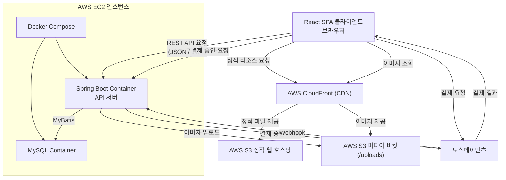

# LinkUp 시스템 아키텍처

## 목차
- [1. 시스템 아키텍처 개요](#1-시스템-아키텍처-개요)
- [2. 시스템 구성](#2-시스템-구성)
- [3. 시스템 아키텍처 설명](#3-시스템-아키텍처-설명)
    - [3.1 프론트엔드](#31-프론트엔드)
    - [3.2 백엔드](#32-백엔드)
    - [3.3 데이터베이스](#33-데이터베이스)
    - [3.4 이미지 파일 저장](#34-이미지-파일-저장)
    - [3.5 결제 및 구독](#35-결제-및-구독)
- [4. 전체 요청 흐름](#4-전체-요청-흐름)
    - [4.1 정적 파일 요청](#41-정적-파일-요청)
    - [4.2 REST API 요청](#42-rest-api-요청)
    - [4.3 이미지 업로드 및 조회](#43-이미지-업로드-및-조회)
    - [4.4 결제 및 구독 요청](#44-결제-및-구독-요청)

## 1. 시스템 아키텍처 개요

LinkUp은 React 기반의 클라이언트와 Spring Boot 기반의 REST API 서버를 분리한 계층형 아키텍처를 채택한다.

프론트엔드는 AWS S3와 CloudFront를 통해 정적 리소스를 제공하고, 백엔드는 AWS EC2에서 Docker 컨테이너로 실행한다.

데이터베이스는 MySQL을 사용하며, 게시글 및 프로필 이미지는 S3에 저장하고 CloudFront를 통해 제공한다.

구독 결제는 토스페이먼츠를 활용하며, 결제 결과는 백엔드에서 검증하여 구독 상태를 관리한다.

## 2. 시스템 구성



## 3. 시스템 아키텍처 설명

### 3.1 프론트엔드
- React SPA로 웹 클라이언트를 구성한다.
- 빌드된 정적 파일 AWS S3에 저장한다.
- AWS CloudFront를 통해 정적 파일을 CDN으로 제공한다.
- 사용자의 API 요청은 JWT를 포함하여 EC2의 Spring Boot API 서버로 전달한다.

### 3.2 백엔드
- AWS EC2 인스턴스에서 Docker Compose를 사용하여 Spring Boot API 서버를 컨테이너로 실행한다.
- REST API를 통해 회원, 게시글, 댓글, 좋아요, 팔로우, 구독 등의 기능을 처리한다.
- Spring Security를 이용하여 인증 및 권한을 관리한다.
- MyBatis를 통해 MySQL 컨테이너와 연동하여 데이터를 조회하고 변경한다.
- 이미지 업로드 요청을 처리하고, 업로드된 이미지 파일은 AWS S3에 저장한다.
- S3에 저장된 파일의 메타데이터와 서비스 관련 정보는 MySQL에서 관리한다.

### 3.3 데이터베이스
- AWS EC2 인스턴스에서 Docker Compose를 사용하여 MySQL 컨테이너를 실행한다.
- MySQL을 사용하여 서비스의 주요 데이터를 저장한다.
- 회원 및 프로필
- 게시글 및 댓글
- 좋아요 및 북마크
- 팔로우 및 차단
- 크리에이터 및 구독
- 결제 내역
- 알림 및 신고 정보

등의 데이터를 관리한다.

### 3.4 이미지 파일 저장
- 이미지 파일은 데이터베이스에 직접 저장하지 않고 AWS S3에 저장한다.
- 이미지 파일에 대한 URL 및 메타데이터는 MySQL에서 관리한다.
- 사용자가 이미지를 조회할 때는 CloudFront를 통해 S3의 이미지 파일을 제공한다.
- 이를 통해 이미지 파일과 서비스 데이터를 분리하여 관리한다.

### 3.5 결제 및 구독
- 크리에이터 구독 결제는 토스페이먼츠를 이용한다.
- 사용자가 구독을 신청하면 토스페이먼츠를 통해 결제를 진행한다.
- Spring Boot 서버는 주문 및 결제 정보를 검증한 후 구독 상태를 변경한다.
- 결제 및 구독 관련 정보는 MySQL에 저장한다.
- 토스페이먼츠의 Webhook을 통해 결제 상태 변경 사항을 전달받아 서버에 반영한다.

## 4. 전체 요청 흐름
- 사용자는 React SPA를 통해 기능을 이용하며, 요청 유형에 따라 CloudFront, S3, EC2, MySQL, 토스페이먼츠와 연결된다.

```markdown
사용자
↓
React SPA
├─ 정적 파일 → CloudFront → S3
├─ 이미지 조회 → CloudFront → S3
├─ REST API → EC2 → Spring Boot → MyBatis → MySQL
└─ 결제 → 토스페이먼츠 → Spring Boot → MySQL
```

### 4.1 정적 파일 요청
- 사용자가 웹 페이지에 접속하면 React 정적 파일을 CloudFront를 통해 요청한다.
- CloudFront는 S3에 저장된 React 빌드 파일을 사용자에게 전달한다.

### 4.2 REST API 요청
- 회원, 게시글, 댓글, 좋아요, 팔로우, 구독 등의 기능은 React에서 REST API 요청을 전송한다.
- API 요청은 EC2에서 실행 중인 Spring Boot 컨테이너에서 처리한다.
- Spring Security를 통해 인증 및 권한을 확인하고, 비즈니스 로직을 수행한다.
- MyBatis를 통해 MySQL 컨테이너의 데이터를 조회하거나 변경한다..
- 처리 결과는 JSON 형태로 React에 반환한다.

### 4.3 이미지 업로드 및 조회
- 사용자가 이미지를 업로드 하면 React에서 Spring Boot API 서버로 전달한다.
- Spring Boot는 파일을 S3에 저장하고 파일 정보를 데이터베이스에 관리한다.
- 이미지 조회 시 CloudFront를 통해 S3 이미지를 제공한다.

### 4.4 결제 및 구독 요청
- 사용자가 크리에이터 구독을 신청하면 토스페이먼츠를  통해 결제를 진행한다.
- 결제 결과를 바탕으로 Spring Boot 서버가 결제 정보를 검증하고 구독 상태를 변경한다.
- 결제 및 구독 정보는 MySQL에 저장하며, 토스페이먼츠의  Webhook을 통해 결제 상태 변경 사항을 반영한다.