# LinkUp 와이어프레임

## 목차
- [0. 주요 화면 목록 (프론트엔드 API)](#0-주요-화면-목록-프론트엔드-api)
- [1. 공통 nav](#1-공통-nav)
  - [1.1 로그인 시 nav](#11-로그인-시-nav)
  - [1.2 비 로그인 시 nav](#12-비-로그인-시-nav)
  - [1.3 로그아웃 팝업](#13-로그아웃-팝업)
- [2. 메인 화면](#2-메인-화면-)
  - [2.1 메인 페이지](#21-메인-페이지)
  - [2.2 포스트 카드](#22-포스트-카드)
- [3. 로그인(회원가입)](#3-로그인회원가입-login)
- [4. 설정 페이지](#4-설정-페이지-settings)
- [5. 게시글](#5-게시글)
  - [5.1 게시글 작성 화면](#51-게시글-작성-화면-posts)
  - [5.2 게시글 상세 화면](#52-게시글-상세-화면-postspostid)
  - [5.3 게시글 수정 화면](#53-게시글-수정-화면-postspostid)
- [6. 검색](#6-검색-search)
- [7. 구독](#7-구독-subscriptions)
- [8. 크리에이터](#8-크리에이터)
  - [8.1 크리에이터 페이지](#81-크리에이터-페이지-creators)
  - [8.2 내 프로필 화면](#82-내-프로필-화면-profileme)
  - [8.3 사용자 프로필 화면](#83-사용자-프로필-화면-profilememberid)
  - [8.4 사용자 프로필 팔로우/팔로잉 목록 화면](#84-사용자-프로필-팔로우팔로잉-목록-화면-profilefollow)
- [9. 신고](#9-신고)
- [10. 회원 / 구독](#10-회원--구독)
  - [10.1 회원 / 구독 판매자 조회](#101-회원--구독-판매자-조회-adminmembers)
  - [10.2 구독/결제 조회 페이지](#102-구독결제-조회-페이지--adminpayments)
- [11. 알림](#11-알림)
- [12. 전체 와이어프레임](#12-전체-와이어프레임)

## 0. 주요 화면 목록 (프론트엔드 API)

| 구분 | 화면명 | HTTP Method & URL | 설명 / 비고 |
| --- | --- | --- | --- |
| 메인 | 메인 화면 | `/` | 서비스 메인 페이지 |
|  | 팔로잉 피드 | `/feed/following` | 팔로우 사용자 게시글 |
|  | 구독 피드 | `/feed/subscriptions` | 구독 사용자 게시글 |
|  | 인기 피드 | `/feed/popular` | 인기 게시글 |
| 회원 | 로그인 | `/login` | OAuth 로그인 |
| 게시글 | 게시글 목록 | `/posts` | 게시글 전체 목록 |
|  | 게시글 상세 | `/posts/{postId}` | 게시글 상세 조회 |
|  | 게시글 등록 | `/posts/new` | 게시글 등록 |
|  | 게시글 수정 | `/posts/{postId}/edit` | 게시글 수정 |
| 댓글 | 댓글 목록 | `/posts/{postId}/replies` | 댓글 목록 |
| 프로필 | 내 프로필 | `/members/me` | 내 프로필 조회 |
|  | 다른 사용자 프로필 | `/members/{memberId}` | 타 사용자 프로필 |
|  | 프로필 수정 | `/members/me/edit` | 프로필 수정 |
| 구독 | 구독 목록 | `/subscriptions` | 내가 구독한 크리에이터 |
| 알림 | 알림 목록 | `/notifications` | 알림 조회 |
| 검색 | 검색 | `/search` | 사용자 및 게시글 검색 |
| 관리자 | 관리자 대시보드 | `/admin/dashboard` | 운영 현황 |
|  | 신고 관리 | `/admin/reports` | 신고 목록 관리 |
|  | 회원 관리 | `/admin/members` | 회원 관리 |
|  | 구독 / 결제 관리 | `/admin/payments` | 구독 / 결제 관리 |
| 설정 | 설정 | `/settings` | 설정 페이지 |

## 1. 공통 nav

### 1.1 로그인 시 nav

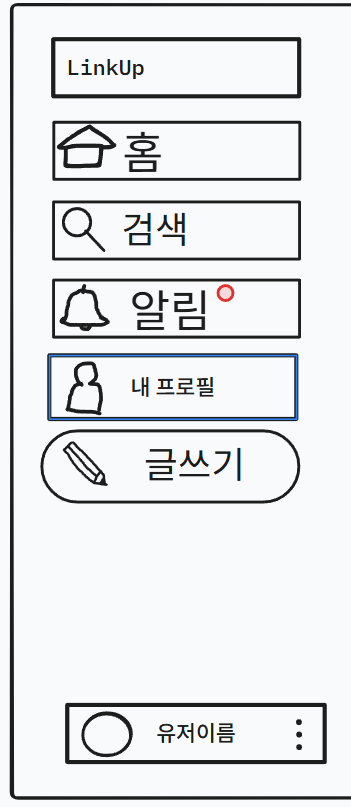

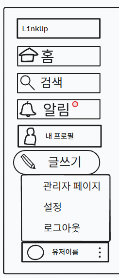

- **출력 항목**
    - LinkUp 로고, 홈, 검색, 알림, 내 프로필, 글쓰기
    - 하단 드롭박스 버튼: 하단에 프로필 이미지와 유저 닉네임 출력, 설정 토글 출력
    - 해당 nav 영역은 존재하는 대부분의 다른 화면들에서도 공통적으로 적용
        - 예외들도 존재함
- **화면 제어 및 권한 규칙**
    - LinkUp 로고, 홈 버튼 : 클릭시 메인페이지(`/`)페이지로 이동
    - 검색 버튼: 클릭시 검색페이지(`/search`)로 이동
    - 알림
        - 클릭 이벤트: 알림 페이지(`/notifications`)로 이동
        - 읽지 않는 알림이 존재할 경우 빨간색 점등 표시를 출력
    - 내 프로필 클릭 시 본인 프로필 페이지(`/members/me`)로 이동
    - 글쓰기 페이지: 글쓰기 페이지(`/posts/new`)로 이동
    - 하단 드롭박스
        - 드롭박스 버튼으로 클릭시 관리자 페이지, 설정, 로그아웃 버튼 출력
            - 관리자 페이지 클릭시: 관리자 페이지(`/admin/dashboard`)로 이동
                - 관리자 페이지 버튼은 관리자 권한을 가진 사용자에게만 출력
            - 설정 버튼 클릭시: 설정 페이지(`/settings`)로 이동
            - 로그아웃 버튼 클릭시: 로그아웃 팝업 페이지 출력

### 1.2 비 로그인 시 nav

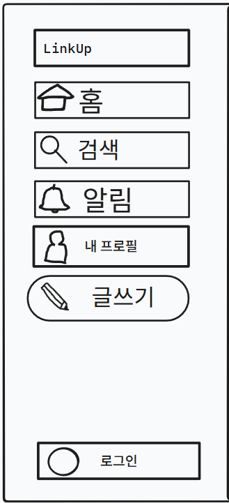

- **출력 항목**
    - 하단 드롭박스 버튼만 로그인 버튼으로 변경
- **화면 제어 및 권한 규칙**
    - LinkUp 로고, 홈 버튼, 검색 버튼은 로그인 nav와 동일
    - 알림, 내 프로필, 글쓰기, 로그인 버튼 클릭시 로그인 페이지()로 이동

### 1.3 로그아웃 팝업

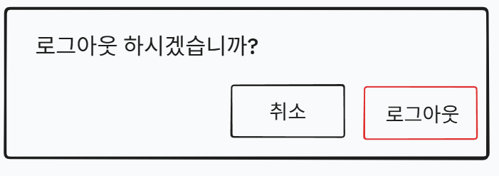

- **출력 항목**
    - 취소, 로그아웃 버튼
- **화면 제어 및 권한 규칙**
    - 취소, 로그아웃 레이어 바깥쪽을 클릭시 로그아웃 팝업 닫기(제거)
    - 로그아웃을 클릭시 현재 사용자에 대해서 로그아웃(세션 제거)

## 2. 메인 화면 (`/`)

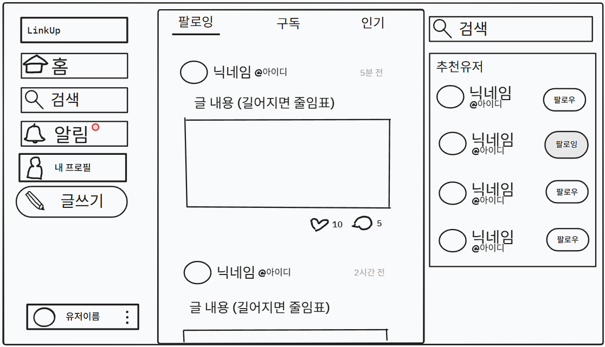

### 2.1 메인 페이지

- **출력 항목**
    - 팔로잉, 구독, 인기 탭 버튼
    - 포스트 카드 (포스트 카드 세부 사항 참조)
    - 검색 입력 창
    - 오른쪽 nav
        - 추천 유저 세션
            - 사용자 닉네임, 아이디, 팔로우/팔로잉 토글 버튼
            - 전체 유저중에서 팔로우가 많은 유저를 순차적으로 4명 출력
            - 팔로우 되어 있지 않으면 팔로우 버튼, 팔로우 되어 있으면 팔로잉 버튼 출력
- **입력 데이터 및 검증 규칙**
    - 검색 입력창
        - 아무것도 입력 되어 있지 않다면 동작 X
        - 검색 입력창에 문자열을 입력하고 커서가 포커스 된 상태에서 엔터를 입력하면 해당 문자열을 전달하여 검색 페이지(`/search`)로 이동
- **화면 제어 및 권한 규칙**
    - 팔로잉 탭 클릭: 사용자가 팔로우 하고 있는 사용자의 게시글들을 최신순으로 출력
    - 구독 탭 클릭: 사용자가 구독하고 있는 사용자의 게시글들을 최신순으로 출력
    - 인기 탭 클릭: 전체 게시글 중 좋아요를 많이 받은 게시글들을 내림차순으로 출력
        - 여유 되면 하루 단위로 좋아요 많이 받은 게시글들을 내림차순으로 출력하는 것을 고려
    - 포스트 카드: 포스트 카드 세부 사항 참조
    - 추천 유저 세션
        - 유저 프로필 사진, 닉네임 클릭: 해당 유저 프로필 페이지(`/members/{memberId}`)로 이동
        - 팔로우/팔로잉 토글 버튼
            - 팔로우 상태에서 클릭시 해당 유저를 팔로우
            - 팔로잉 상태에서 클릭시 해당 유저를 언팔로우

### 2.2 포스트 카드

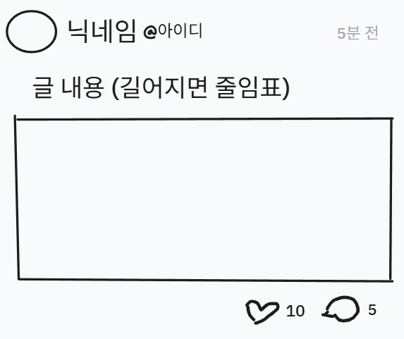

- **출력 항목**
    - 프로필 영역: 프로필 이미지, 닉네임, 아이디
    - 게시글 영역: 글 내용, 사진, 게시글 생성 시간, 게시글 설정 버튼(점 세개버튼), 좋아요 토글 버튼, 좋아요 갯수, 댓글 버튼, 댓글 갯수
- **화면 제어 및 권한 규칙**
    - 프로필 이미지, 닉네임 클릭: 해당 유저 프로필 페이지(`/members/{memberId}`)로 이동
    - 포스트 카드 영역, 사진, 댓글 버튼 클릭: 해당 게시글 상세보기 페이지(`/posts/{postId}`)로 이동
    - 좋아요 토글 버튼
        - 좋아요 비활성화 상태에서 클릭: 좋아요 활성화, 좋아요 갯수 증가
        - 좋아요 활성화 상태에서 클릭: 좋아요 비활성화, 좋아요 갯수 감소

## 3. 로그인(회원가입) (`/login`)

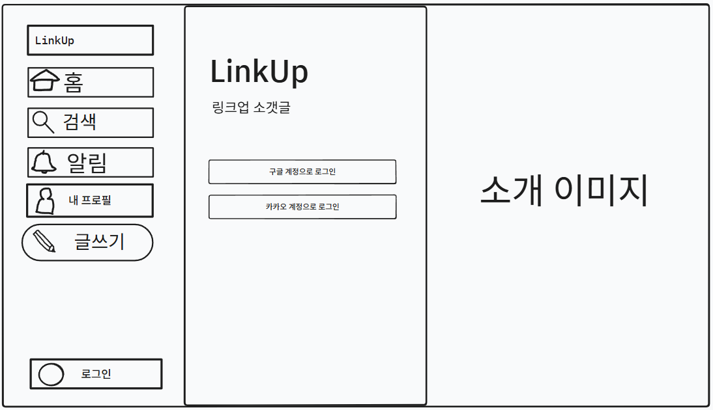

- **출력 항목**
    - 중앙 로그인 영역: LinkUp 로고, 구글 계정 로그인 버튼, 카카오 계정 로그인 버튼
    - 소개이미지: static으로 저장된 소개이미지 출력
- **화면 제어 및 권한 규칙**
    - LinkUp 로고: 클릭시 메인 페이지(`/`)로 이동
    - 구글/카카오 계정 로그인 버튼
        - OAuth로 리다이렉션 후 조건에 따라 진행
        - 처음 로그인(회원가입) 시: OAuth를 통해 받은 응답 JSON으로 member 등록을 진행, 그 후 메인 페이지(`/`)로 이동
        - 등록 된 상태에서 로그인(회원가입) 시: OAuth를 통해 받은 응답으로 member 확인, 그 후 메인 페이지(`/`)로 이동

## 4. 설정 페이지 (`/settings`)

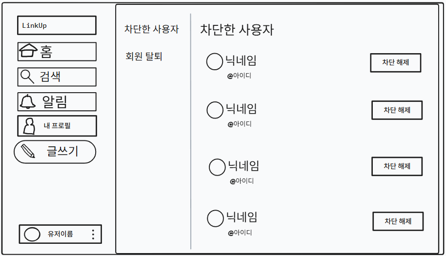

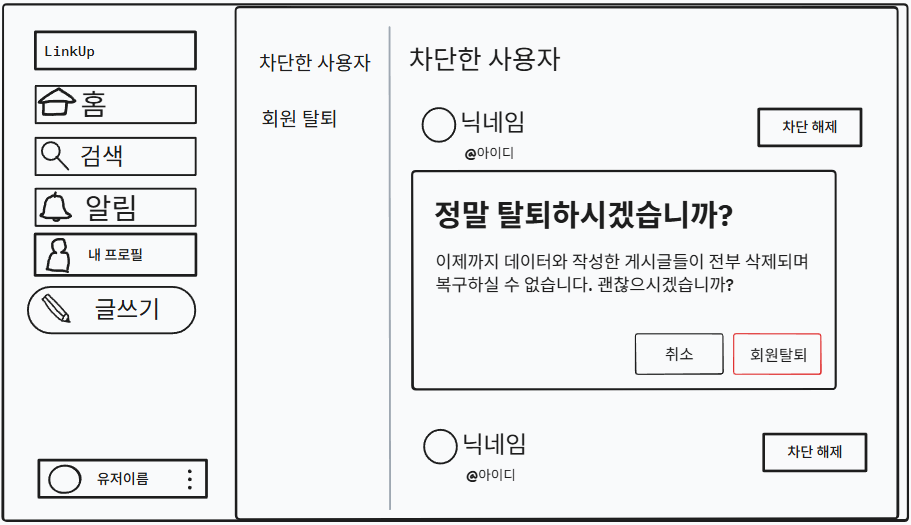

- **출력 항목**
    - 설정 페이지 탭 영역: 차단한 사용자, 회원 탈퇴
    - 차단한 사용자 영역: 프로필 이미지, 닉네임, 아이디, 차단 해제 버튼
- **화면 제어 및 권한 규칙**
    - 차단한 사용자 탭 클릭: 차단한 사용자 영역 표시
    - 회원 탈퇴 탭 클릭: 회원탈퇴 팝업 페이지 출력
    - 차단한 사용자 영역
        - 프로필, 닉네임 클릭: 해당 사용자의 프로필 페이지로 이동
        - 차단 해제 클릭: 사용자 차단 리스트에서 해당 사용자를 리스트에서 제거, 곧바로 차단한 사용자 UI에 반영
    - 회원탈퇴 팝업 페이지
        - 취소, 로그아웃 레이어 바깥쪽 클릭: 회원탈퇴 팝업 닫기(제거)
        - 회원탈퇴 클릭: 해당 사용자에 대해서 로그아웃 처리(세션제거)후 사용자에 관련된 모든 데이터와 게시글들을 삭제

## 5. 게시글

### **5.1 게시글 작성 화면 (`/posts`)**

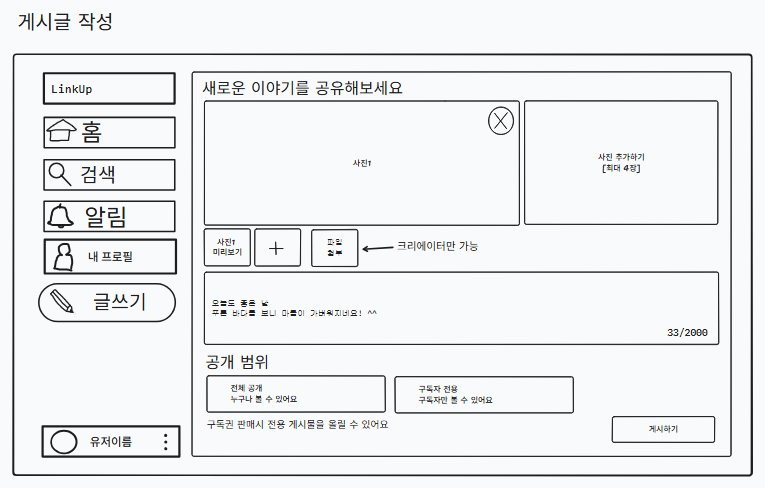

- **출력 데이터 항목**
    - 이미지 업로드 영역: 게시글에 첨부할 이미지 등록 영역
    - 이미지 미리보기 영역: 등록된 이미지 목록 및 선택 이미지 표시
    - 파일 첨부 버튼
    - 게시글 내용 입력 필드: 게시글 본문 작성 영역 및 글자 수
    - 공개 범위 설정: 전체 공개, 구독자 전용
    - 제어 버튼: 게시하기 버튼
- **입력 데이터 및 검증 규칙**
    - 게시글 내용 입력: 필수 입력 항목, 1~2000자 제한
    - 이미지 업로드 영역: 최소 1개의 이미지 첨부 필수
- **화면 제어 및 동작 규칙**
    - 게시글에 최대 4장의 이미지 첨부 가능
    - 업로드한 이미지의 미리보기 제공
    - 등록한 이미지 삭제 가능
    - 파일 첨부 버튼 클릭시 형식 제한 없는 파일 첨부 가능 (100MB 제한)
        - 크리에이터 권한이 있는 사용자에게만 표시
    - 게시글 내용 입력 시 현재 입력 글자 수 표시
    - 전체 공개 선택 시 모든 사용자가 게시글 조회 가능
    - 구독자 전용 선택 시 작성자를 구독 중인 사용자만 게시글 조회 가능
    - 게시하기 버튼 클릭 시 입력 데이터 검증 후 게시글 등록
    - 게시글 등록 완료 후 해당 게시글 상세 화면으로 이동

### **5.2 게시글 상세 화면 (`/posts/{postId}`)**

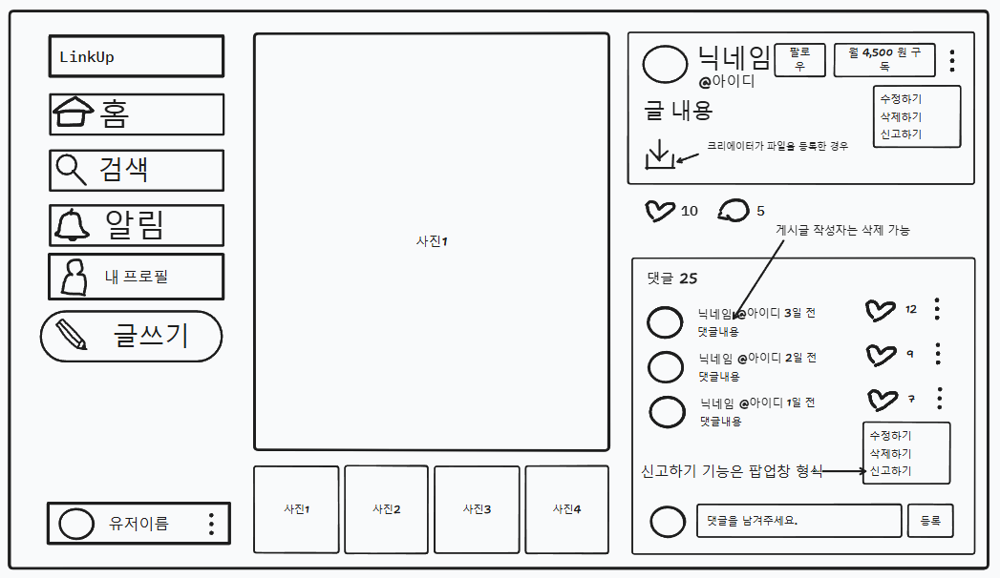

- **출력 데이터 항목**
    - 게시글 이미지 영역: 대표 이미지 및 추가 이미지 목록
    - 작성자 정보: 프로필 이미지, 닉네임, 아이디
    - 게시글 정보: 게시글 내용, 작성 시간
    - 상호작용 요소: 좋아요 버튼 및 좋아요 수, 댓글 수
    - 댓글 목록: 댓글 작성자 프로필, 닉네임, 작성 시간, 댓글 내용, 좋아요 수
    - 댓글 작성 영역: 댓글 입력 필드 및 등록 버튼
    - 댓글 관리 메뉴: 수정, 삭제, 신고 메뉴
- **입력 데이터 및 검증 규칙**
    - 댓글 내용 입력: 필수 입력 항목, 1~500자 제한
- **화면 제어 및 동작 규칙**
    - 하단 이미지 미리보기 클릭 시 선택한 이미지를 메인 이미지 영역에 표시
    - 본인이 작성한 게시글인 경우에만 수정/삭제 옵션 노출
    - 다른 사용자의 게시글인 경우 신고 옵션 노출
    - 좋아요 아이콘 클릭 시 좋아요 상태 및 좋아요 수 변경
    - 댓글 작성 후 등록 시 댓글 목록에 작성한 댓글 반영
    - 본인이 작성한 게시글에 달린 댓글, 본인이 작성한 댓글에만 수정/삭제 옵션 노출
    - 작성자 프로필 클릭 시 해당 사용자의 프로필 화면으로 이동

### **5.3 게시글 수정 화면 (`/posts/{postId}`)**

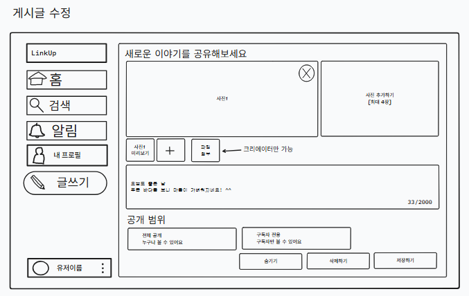

- **출력 데이터 항목**
    - 게시글 이미지 영역: 기존 게시글 이미지 미리보기
    - 이미지 관리 영역: 이미지 추가, 삭제 기능
    - 게시글 내용 입력 필드: 기존 게시글 본문 내용 및 글자 수
    - 파일 첨부 버튼
    - 공개 범위 설정: 전체 공개, 구독자 전용
    - 제어 버튼: 숨기기, 삭제하기, 저장하기 버튼
- **입력 데이터 및 검증 규칙**
    - 게시글 내용 입력: 필수 입력 항목, 1~2000자 제한
    - 이미지 업로드 영역: 최소 1개의 이미지 첨부 필수
- **화면 제어 및 동작 규칙**
    - 게시글 작성자 본인만 게시글 수정 화면에 접근 가능
    - 크리에이터만 파일 첨부 가능
    - 기존 이미지 삭제 및 새로운 이미지 추가 가능
    - 파일 첨부 버튼 클릭시 형식 제한 없는 파일 첨부 가능 (100MB 제한)
        - 크리에이터 권한이 있는 사용자에게만 표시
    - 전체 공개 또는 구독자 전용으로 게시글 공개 범위 변경 가능
    - 저장하기 버튼 클릭 시 변경된 게시글 정보 저장
    - 삭제하기 버튼 클릭 시 게시글 삭제 처리
    - 수정 완료 후 해당 게시글 상세 화면으로 이동

## 6. 검색 (`/search`)

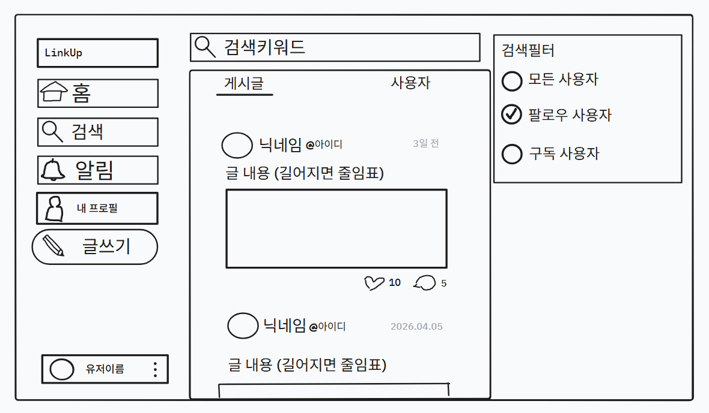

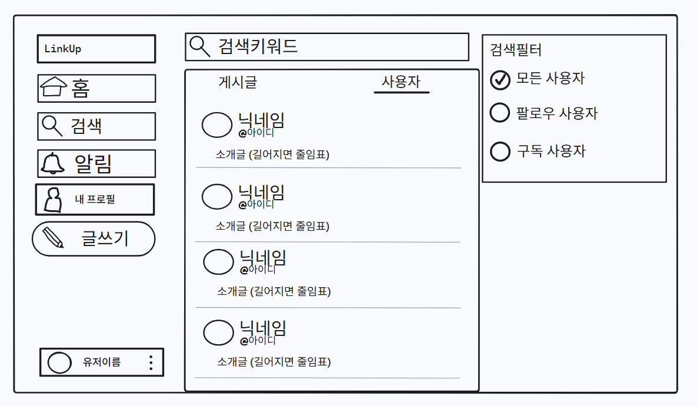

- **출력 항목**
    - 검색 입력 창
    - 검색 필터 라디오 버튼: 모든 사용자, 팔로우 사용자, 구독 사용자
    - 게시글 탭, 사용자 탭
    - 게시글 영역: 포스트카드
    - 사용자 영역: 프로필 이미지, 닉네임, 아이디, 소개글
- **입력 데이터 및 검증 규칙**
    - 검색 입력창
        - 아무것도 입력 되어 있지 않다면 동작 X
        - 검색 입력창에 문자열을 입력하고 커서가 포커스 된 상태에서 엔터를 입력하면 해당 문자열을 전달하여 게시글/사용자 영역을 갱신
- **화면 제어 및 권한 규칙**
    - 게시글 탭 클릭: 게시글 영역으로 전환
    - 사용자 탭 클릭: 사용자 영역으로 전환
    - 검색필터 라디오 버튼
        - 모든 사용자: 전체 사용자를 대상으로 게시글 검색
        - 팔로우 사용자: 팔로잉 사용자를 대상으로 게시글 검색
        - 구독 사용자: 구독 사용자를 대상으로 게시글 검색
    - 게시글 영역
        - 포스트 카드: 포스트 카드 세부 사항 참조
    - 사용자 영역
        - 프로필 이미지, 닉네임, 사용자 프로필 영역 클릭: 해당 사용자의 프로필 페이지로 이동

## 7. 구독 **(`/subscriptions`)**

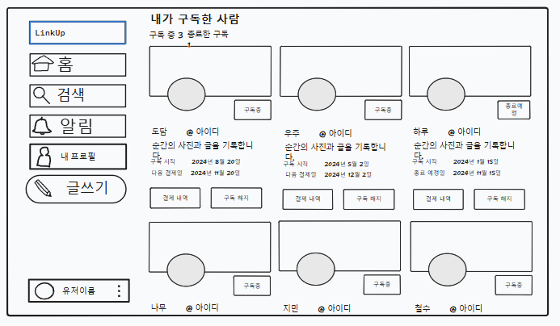

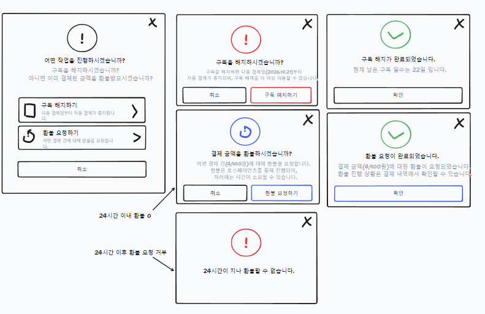

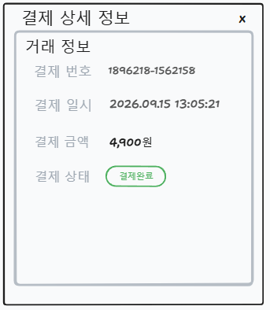

- **출력 데이터 항목**
    - 구독 현황: 현재 구독 중인 크리에이터 수
    - 구독 크리에이터 목록: 프로필 이미지, 닉네임, 아이디, 소개
    - 구독 정보: 구독 시작일, 다음 결제 예정일, 구독 상태
    - 구독 관리 버튼: 구독 해지
    - 구독 결제 내역: 결제 번호, 결제일, 결제 금액, 결제 상태
- **화면 제어 및 동작 규칙**
    - 현재 구독 중인 크리에이터 목록과 구독 상태 표시
    - 크리에이터 프로필 클릭 시 해당 사용자의 프로필 화면으로 이동
    - 구독 해지 버튼 클릭 시 확인 절차 후 구독 해지 처리
    - 결제 내역을 클릭 시 결제 내역 표시

## 8. 크리에이터

### **8.1 크리에이터 페이지 (`/creators`)**

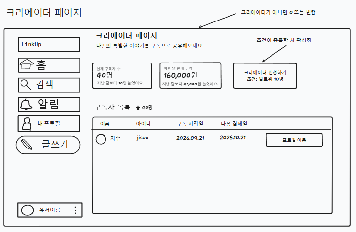

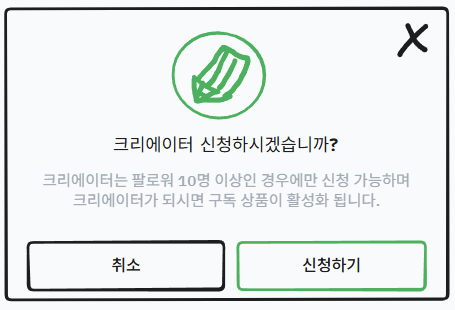

- **출력 데이터 항목**
    - 구독 현황: 현재 구독자 수
    - 구독 수익 정보: 이번 달 구독을 통해 발생한 수익
    - 구독자 목록: 구독자의 프로필 이미지, 이름, 아이디, 구독 시작일, 다음 결제일
    - 구독 관리 영역: 구독 상품 신청 및 관리 기능
    - 크리에이터 신청 버튼
    - 프로필 이동 버튼
- **화면 제어 및 동작 규칙**
    - 크리에이터 권한을 가진 사용자만 해당 화면에 유효한 값 표시
    - 현재 활성 상태인 구독을 기준으로 구독자 수 표시
    - 구독 결제 내역을 기준으로 구독 수익 정보 표시
    - 구독자 목록에서 현재 구독 중인 사용자의 정보 조회
    - 크리에이터 조건을 충족한 경우 크리에이터 신청하기 버튼 활성화
    - 크리에이터 신청하기 클릭: 크리에이터 신청 팝업이 출력
        - 취소, 크리에이터 신청 팝업 바깥 영역 클릭: 팝업창 제거
        - 신청하기 클릭: 크리에이터 권한으로 변경후 내 프로필 페이지 갱신
    - 크리에이터 자격인 경우 통계 기능 제공 (구독자 수)

### **8.2 내 프로필 화면 (`/profile/me`)**

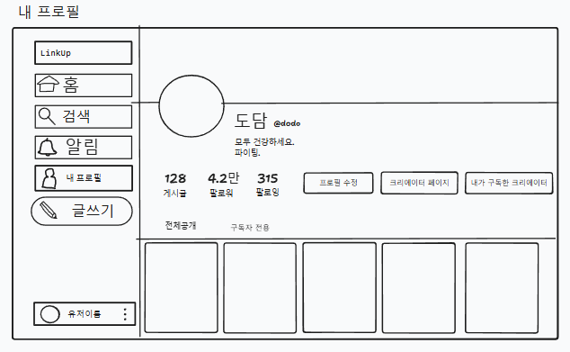

- **출력 데이터 항목**
    - 프로필 정보: 프로필 이미지, 닉네임, 아이디, 자기소개
    - 활동 정보: 게시글 수, 팔로워 수, 팔로잉 수
    - 프로필 관리 버튼: 프로필 수정, 게시글 관리, 구독권 관리
    - 게시글 공개 범위 탭: 전체 공개, 구독자 전용
    - 게시글 목록: 사용자가 작성한 게시글 이미지 목록
- **화면 제어 및 동작 규칙**
    - 현재 로그인한 사용자의 프로필 및 활동 정보 표시
    - 프로필 수정 버튼 클릭 시 프로필 수정 화면으로 이동
    - 크리에이터 버튼 클릭 시 크리에이터 페이지로 이동
    - 전체 공개 탭 선택 시 본인이 작성한 전체 공개 게시글 표시
    - 구독자 전용 탭 선택 시 본인이 작성한 구독자 전용 게시글 표시
    - 목록이 많을 경우 스크롤을 통해 추가 게시글 조회
    - 게시글 이미지 클릭 시 해당 게시글 상세 화면으로 이동
    - 팔로워, 팔로잉 클릭 시 팔로워, 팔로잉 페이지 이동
    - 내가 구독한 크리에이터 버튼 클릭 시 내가 구독한 크리에이터 페이지로 이동

### **8.3 사용자 프로필 화면 (`/profile/{memberId}`)**

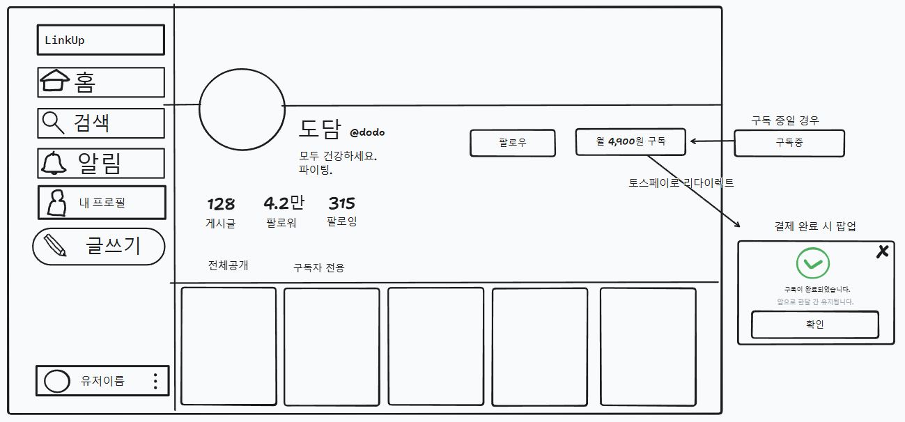

- **출력 데이터 항목**:
    - 프로필 정보: 프로필 이미지, 닉네임, 아이디, 자기소개
    - 활동 정보: 게시글 수, 팔로워 수, 팔로잉 수
    - 사용자 상호작용 버튼: 팔로우 버튼
    - 구독 정보: 월 구독 가격 및 구독 버튼
    - 게시글 공개 범위 탭: 전체 공개, 구독자 전용
    - 게시글 목록: 사용자가 작성한 게시글 이미지 목록
- **화면 제어 및 동작 규칙**
    - 조회 대상 사용자의 프로필 및 활동 정보 표시
    - 팔로우 버튼 클릭 시 팔로우/언팔로우 상태 변경
    - 크리에이터로 등록된 사용자인 경우 월 구독 가격 및 구독 버튼 표시
    - 구독 버튼 클릭 시 해당 크리에이터의 구독 안내 및 결제 화면으로 이동
    - 전체 공개 탭 선택 시 전체 사용자가 조회 가능한 게시글 표시
    - 구독자 전용 탭 선택 시 현재 사용자의 구독 여부 확인
    - 활성 구독 상태인 경우 구독자 전용 게시글 표시
    - 구독하지 않은 사용자의 경우 구독자 전용 게시글 접근 제한
    - 목록이 많을 경우 스크롤을 통해 추가 게시글 조회
    - 게시글 이미지 클릭 시 해당 게시글 상세 화면으로 이동

### **8.4 사용자 프로필 팔로우/팔로잉 목록 화면 (`/profile/follow`)**

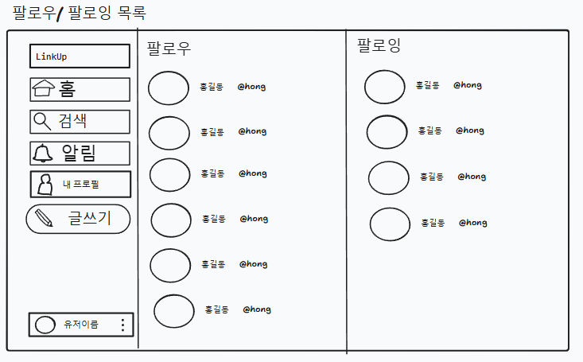

- **출력 데이터 항목**
    - 팔로워 목록: 프로필 이미지, 닉네임, 아이디
    - 팔로잉 목록: 프로필 이미지, 닉네임, 아이디
- **화면 제어 및 동작 규칙**
    - 해당 사용자를 팔로우하고 있는 사용자 목록 표시
    - 해당 사용자가 팔로우하고 있는 사용자 목록 표시
    - 팔로워 또는 팔로잉 사용자의 프로필 클릭 시 해당 사용자의 프로필 화면으로 이동
    - 팔로워 및 팔로잉 목록을 각각 구분하여 표시
    - 목록이 많을 경우 스크롤을 통해 추가 사용자 조회

## 9. 신고 (`/admin/report`)

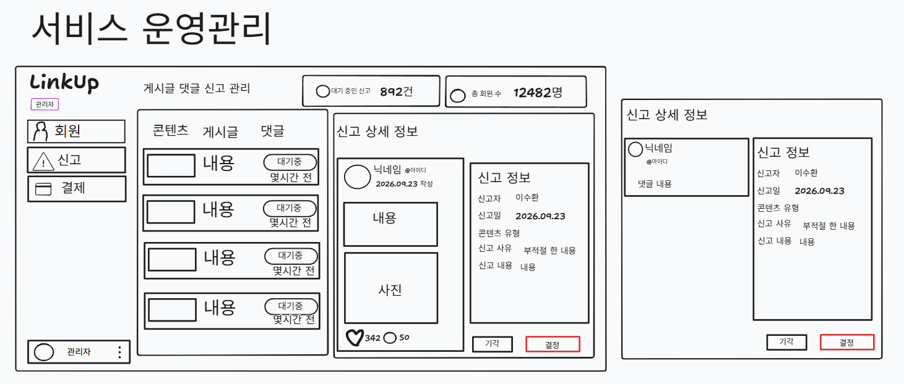

- **출력 데이터 항목**
    - 신고 대상 목록: 신고 대상 유형(게시글, 댓글), 신고 대상 내용, 신고 상태, 신고 접수 일시
    - 신고 상세 정보 : 신고 대상 사용자 정보(프로필 이미지, 닉네임, 아이디), 신고 내용(게시글/댓글 내용, 게시글 이미지)
    - 신고  정보 : 신고자, 신고일, 콘텐츠 유형, 신고 사유, 신고 상세 내용
    - 신고 처리 상태
    - 신고 처리 기능 : 신고 기각, 신고 처리
- **입력 데이터 및 검증 규칙**
    - 신고 대상 유형 : 게시글, 댓글
    - 신고 처리 기능 : 기각 또는 처리 선택
    - 신고 목록 조회 시 페이지 단위로 조회
- **화면 제어 및 동작 규칙**
    - 신고된 게시글 및 댓글 목록을 조회한다.
    - 신고 대상 유형을 **게시글 / 댓글**로 구분하여 조회할 수 있다.
    - 신고 목록에서 특정 신고를 선택하면 신고 상세 정보를 표시한다.
    - 신고 상세 화면에서 신고 대상 콘텐츠와 신고자의 정보를 확인할 수 있다.
    - 게시글 신고인 경우 신고된 게시글의 내용 및 이미지를 표시한다.
    - 댓글 신고인 경우 신고된 댓글의 내용을 표시한다.
    - 신고자의 정보와 신고 사유 및 신고 내용을 표시한다.
    - 처리 대기 중인 신고는 **대기 중** 상태로 표시한다.
    - 관리자가 신고 내용을 확인한 후 **기각 또는 처리**할 수 있다.
    - 신고를 기각하면 해당 신고의 처리 상태를 기각(REJECT)로 변경한다.
    - 신고를 처리하면 해당 신고의 처리 상태를 처리 완료(APPROVAL)로 변경, 해당 게시글,댓글 제거, 해당 사용자에게 경고 카운트 1회 부여한다.
    - 신고 처리 시 신고 대상 콘텐츠에 대한 별도의 조치가 필요한 경우 해당 콘텐츠 관리 화면에서 추가 조치를 수행할 수 있다.
    - 신고 목록이 여러 건인 경우 페이지네이션을 통해 신고 내역을 조회한다.

## 10. 회원 / 구독

### **10.1 회원 / 구독 판매자 조회 (`/admin/members`)**

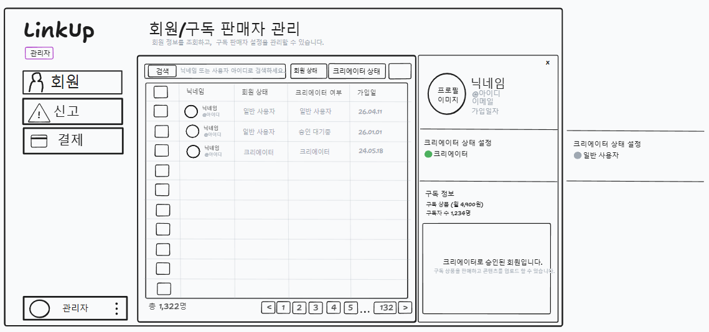

- **출력 데이터 항목**
    - 회원 목록 정보 : 프로필 이미지, 닉네임, 아이디, 회원 상태, 크리에이터 상태, 가입일
    - 회원 상세 정보 : 프로필 이미지, 닉네임, 아이디, 이메일, 가입일
    - 크리에이터 정보 : 크리에이터 상태, 구독 상품 정보, 월 구독 가격, 구독자 수
    - 관리 기능 : 회원 검색, 회원 상태 조회, 크리에이터 상태 조회
- **입력 데이터 및 검증 규칙**
    - 회원 검색
        - 닉네임 또는 아이디를 입력하여 회원 검색
        - 검색어가 입력된 경우 해당 검색어와 일치하는 회원을 조회
    - 회원 상태 필터 : 회원 상태를 기준으로 회원 목록 필터링
    - 크리에이터 상태 필터 : 크리에이터 상태를 기준으로 회원 목록 필터링
- **화면 제어 및 동작 규칙**
    - 회원 목록을 조회하고 회원의 기본 정보를 표시한다.
    - 닉네임 또는 아이디를 입력하여 특정 회원을 검색할 수 있다.
    - 회원 상태 및 크리에이터 상태를 기준으로 회원 목록을 필터링할 수 있다.
    - 회원 목록에서 특정 회원을 선택하면 해당 회원의 상세 정보를 표시한다.
    - 일반 회원과 크리에이터 상태를 구분하여 표시한다.
    - 크리에이터의 경우 월 구독 가격 및 구독자 수를 표시한다.
    - 회원 목록이 여러 페이지로 구성된 경우 페이지 이동을 통해 회원 목록을 조회할 수 있다.

### **10.2 구독/결제 조회 페이지  (`/admin/payments`)**

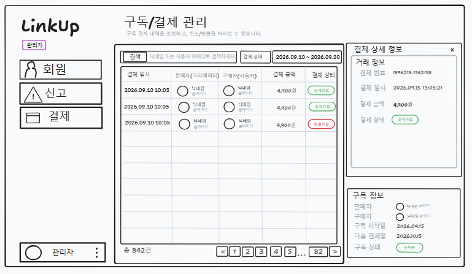

- **출력 데이터 항목**
    - 결제 목록 정보 : 결제 일시, 판매자 정보, 구매자 정보, 결제 금액, 결제 상태
    - 결제 상세 정보 : 결제 번호, 결제 일시, 결제 금액, 결제 상태
    - 구독 정보 : 판매자, 구매자, 구독 시작일, 다음 결제일, 구독 상태
    - 관리 기능 : 결제 검색, 결제 상태 필터링, 결제 기간 조회
- **입력 데이터 및 검증 규칙**
    - 결제 검색
        - 닉네임 또는 아이디를 입력하여 특정 사용자의 결제 내역 검색
        - 검색어가 입력된 경우 해당 검색어와 일치하는 결제 내역을 조회
    - 결제 상태 필터 : 결제 상태를 기준으로 결제 내역 필터링
    - 결제 기간 조회 : 시작을과 종료일을 설정하여 해당 기간의 결제 내역 조회
- **화면 제어 및 동작 규칙**
    - 전체 구독 및 결제 내역을 조회하고 결제 정보를 표시한다.
    - 닉네임 또는 아이디를 입력하여 특정 사용자의 결제 내역을 검색할 수 있다.
    - 결제 상태를 기준으로 결제 내역을 필터링할 수 있다.
    - 특정 기간을 설정하여 해당 기간의 결제 내역을 조회할 수 있다.
    - 결제 목록에서 특정 결제 내역을 선택하면 결제 상세 정보를 표시한다.
    - 결제 상세 정보에서 해당 결제와 연결된 구독 정보를 확인할 수 있다.
    - 결제가 정상적으로 완료된 경우 결제 완료 상태로 표시한다.
    - 결제와 연결된 구독 상태 및 기간을 확인할 수 있다.
    - 결제 내역이 여러 페이지로 구성된 경우 페이지네이션을 통해 결제 내역을 조회한다.

## 11. 알림

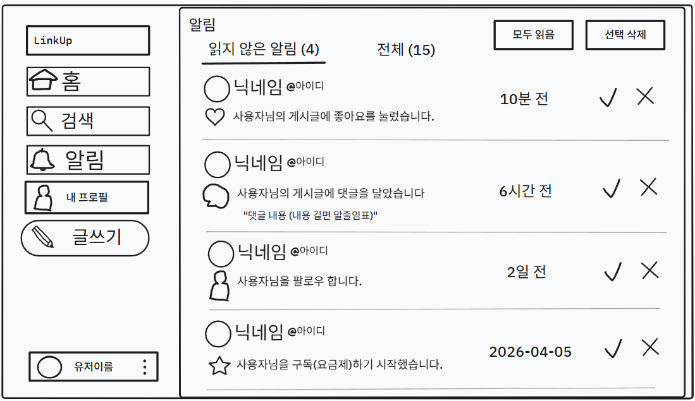

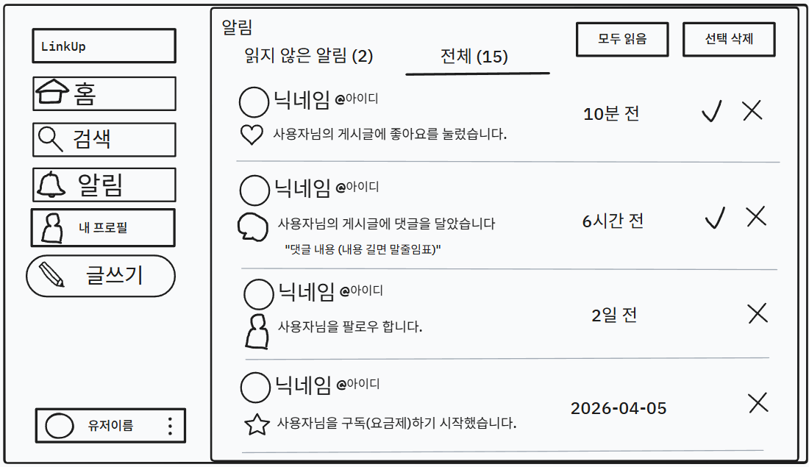

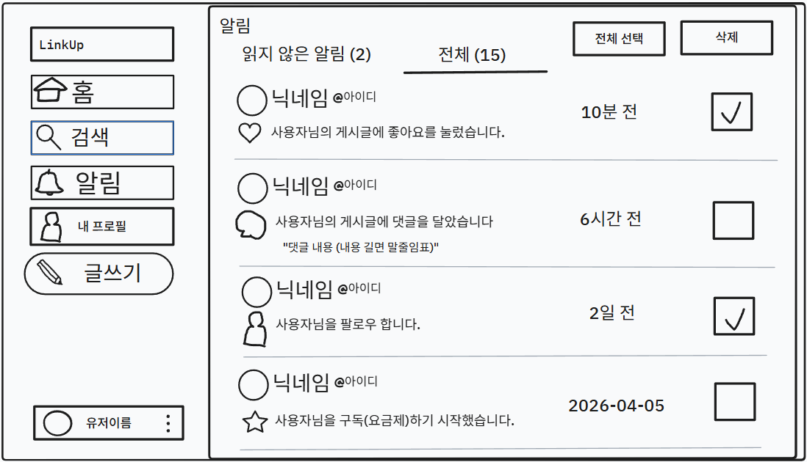

- **출력 데이터 항목**
    - 읽지않은 알림 / 전체 탭
    - 알림 목록 영역: 프로필 이미지, 닉네임, 아이디, 알림 내용, 알림 시간, 읽음 버튼, 알림 삭제 버튼
    - 모두 읽음, 선택 삭제 버튼
- **화면 제어 및 동작 규칙**
    - 읽지않은 알림 / 전체 탭 클릭: 해당 탭으로 알림 목록 영역 갱신
    - 알림 목록 영역
        - 프로필 이미지, 닉네임 클릭: 해당 사용자의 프로필 페이지로 이동
        - 읽음 버튼 클릭
            - 읽지 않은 알림 탭: 해당 목록에서 알림 제거
            - 전체 탭: 읽음 버튼 비활성화(제거)
        - 알림 삭제 버튼 클릭: 알림 목록에서 삭제
    - 모두 읽음 버튼 클릭
        - 읽지 않은 알림 탭: 읽지 않은 알림의 모든 알림 목록을 제거
        - 전체 탭: 읽음 버튼이 있는 알림들 모두 읽음 버튼 비활성화(제거)
    - 선택 삭제 버튼 클릭
        - 모두 읽음 → 전체 선택 / 선택 삭제 → 삭제 버튼으로 변경
        - 각 알림들에 읽음 버튼, 알림 삭제버튼 대신 체크박스 활성화
        - 체크박스 선택후 삭제 버튼을 누르면 해당 알림들이 삭제
        - 전체 선택을 누르면 전체 알림들에 대한 체크박스가 선택

## 12. 전체 와이어프레임

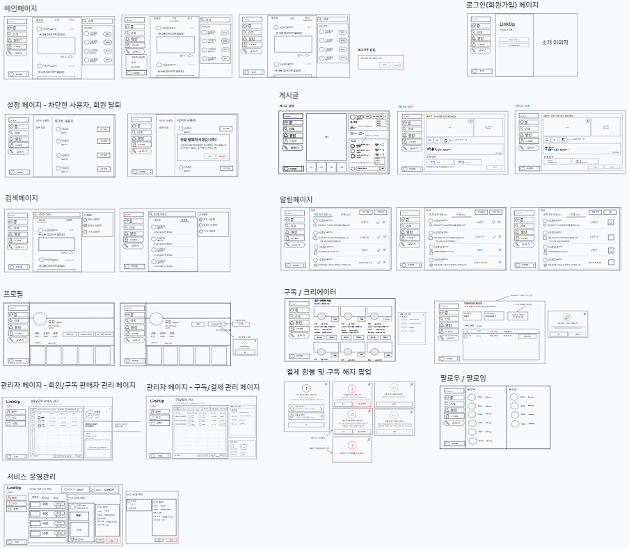