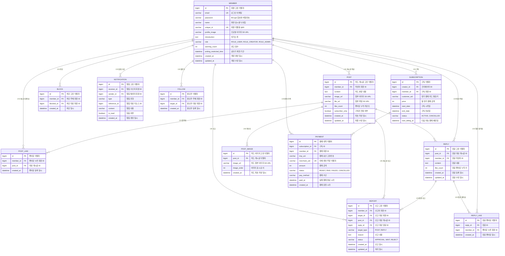

# 📁 데이터베이스 ERD 및 테이블 정의서

## 목차

- [1. Mermaid 기반 ERD 다이어그램](#1-erd-다이어그램)
- [2. 테이블 상세 명세서](#2-테이블-상세-명세서)
  - [2.1 member (회원 기본)](#21-member-회원-기본)
  - [2.2 post (피드 게시글)](#22-post-피드-게시글)
  - [2.3 post_image (피드 이미지)](#23-post_image-피드-이미지)
  - [2.4 post_like (피드 좋아요)](#24-post_like-피드-좋아요)
  - [2.5 reply (피드 댓글)](#25-reply-피드-댓글)
  - [2.6 reply_like (피드 댓글 좋아요)](#26-reply_like-피드-댓글-좋아요)
  - [2.7 block (차단)](#27-block-차단)
  - [2.8 report (신고)](#28-report-신고)
  - [2.9 notification (알림)](#29-notification-알림)
  - [2.10 follow (팔로우, 팔로잉)](#210-follow-팔로우-팔로잉)
  - [2.11 subscription (구독)](#211-subscription-구독)
  - [2.12 payment (결제 이력)](#212-payment-결제-이력)
- [3. 테이블 생성 DDL 스크립트](#3-테이블-생성-ddl-스크립트)

## 1. ERD 다이어그램



## 2. 테이블 상세 명세서

### 2.1 member (회원 기본)

| **컬럼명** | **데이터 타입** | **제약 조건** | **설명** |
| --- | --- | --- | --- |
| id | BIGINT | PK, AUTO_INCREMENT | 회원 고유 식별자 |
| email | VARCHAR(100) | NOT NULL, UNIQUE | 로그인 아이디 (이메일) |
| password | VARCHAR(255) | NOT NULL | BCrypt 암호화된 비밀번호 |
| name | VARCHAR(50) | NOT NULL | 화면 표시용 닉네임 |
| unique_id | VARCHAR(50) | NOT NULL, UNIQUE | 화면 표시, 회원 식별용 아이디 / 가입 시 이메일 @ 앞부분으로 자동 생성되며 이후 수정 가능 |
| profile_image | VARCHAR(255) | NULL | AWS S3 프로필 사진 URL |
| introduction | TEXT | NULL | 자기소개 |
| role | VARCHAR(20) | NOT NULL, DEFAULT 'ROLE_USER' | 권한 (ROLE_USER, ROLE_CREATOR, ROLE_ADMIN) |
| warning_count | INT | NOT NULL, DEFAULT 0 | 경고 횟수 (1회: 단순 경고, 2회: 글쓰기 기간 제한, 3회: 회원 탈퇴) |
| writing_restricted_time | DATETIME | NULL | 글쓰기 제한 기간 
(경고 2회시 해당 시간으로부터 7일 제한) |
| created_at | DATETIME | DEFAULT CURRENT_TIMESTAMP | 계정 생성 일시 |
| updated_at | DATETIME | DEFAULT CURRENT_TIMESTAMP ON UPDATE | 계정 수정 일시 |

### 2.2 post (피드 게시글)

| **컬럼명** | **데이터 타입** | **제약 조건** | **설명** |
| --- | --- | --- | --- |
| id | BIGINT | PK, AUTO_INCREMENT | 피드 게시글 고유 식별자 |
| member_id | BIGINT | NOT NULL, FK (member.id ON DELETE CASCADE) | 작성자 회원 식별자 |
| content | TEXT | NOT NULL | 피드 본문 내용 |
| file_url | VARCHAR(255) | NULL | 파일 첨부 S3 URL |
| like_count | INT | DEFAULT 0 | 좋아요 누적 카운트 |
| subscriber_only | BOOLEAN | NOT NULL, DEFAULT FALSE | 구독자 전용 게시글 여부 |
| created_at | DATETIME | DEFAULT CURRENT_TIMESTAMP | 피드 최초 작성 일시 |
| updated_at | DATETIME | DEFAULT CURRENT_TIMESTAMP ON UPDATE | 피드 최종 수정 일시 |

### 2.3 post_image (피드 이미지)

| **컬럼명** | **데이터 타입** | **제약 조건** | **설명** |
| --- | --- | --- | --- |
| id | BIGINT | PK, AUTO_INCREMENT | 피드 이미지 고유 식별자 |
| post_id | BIGINT | NOT NULL, FK (post.id ON DELETE CASCADE) | 피드 게시글 식별자 |
| image_url | VARCHAR(255) | NULL | 피드 첨부 이미지 S3 URL |
| image_order | INT | NOT NULL | 이미지 표시 순서 |
| created_at | DATETIME | DEFAULT CURRENT_TIMESTAMP | 피드 최초 작성 일시 |

### 2.4 post_like (피드 좋아요)

| **컬럼명** | **데이터 타입** | **제약 조건** | **설명** |
| --- | --- | --- | --- |
| id | BIGINT | PK, AUTO_INCREMENT | 좋아요 식별자 |
| member_id | BIGINT | NOT NULL, FK (member.id ON DELETE CASCADE) | 좋아요를 누른 회원 ID |
| post_id | BIGINT | NOT NULL, FK (post.id ON DELETE CASCADE) | 대상 피드 게시글 ID |
| created_at | DATETIME | DEFAULT CURRENT_TIMESTAMP | 좋아요 등록 일시 |
- 고유 제약조건: UNIQUE KEY `uk_member_post_like` (`member_id`, `post_id`)

### 2.5 reply (피드 댓글)

| **컬럼명** | **데이터 타입** | **제약 조건** | **설명** |
| --- | --- | --- | --- |
| id | BIGINT | PK, AUTO_INCREMENT | 댓글 고유 식별자 |
| post_id | BIGINT | NOT NULL, FK (post.id ON DELETE CASCADE) | 댓글이 달린 피드 식별자 |
| member_id | BIGINT | NOT NULL, FK (member.id ON DELETE CASCADE) | 댓글 작성자 식별자 |
| content | TEXT | NOT NULL | 댓글 텍스트 내용 |
| like_count | INT | DEFAULT 0 | 댓글 누적 좋아요 수 |
| created_at | DATETIME | DEFAULT CURRENT_TIMESTAMP | 댓글 등록 일시 |
| updated_at | DATETIME | DEFAULT CURRENT_TIMESTAMP ON UPDATE | 댓글 수정 일시 |

### 2.6 reply_like (피드 댓글 좋아요)

| **컬럼명** | **데이터 타입** | **제약 조건** | **설명** |
| --- | --- | --- | --- |
| id | BIGINT | PK, AUTO_INCREMENT | 댓글 좋아요 고유 식별자 |
| reply_id | BIGINT | NOT NULL, FK (reply.id ON DELETE CASCADE) | 댓글 식별자 |
| member_id | BIGINT | NOT NULL, FK (member.id ON DELETE CASCADE) | 댓글 좋아요 누른 회원 ID |
| created_at | DATETIME | DEFAULT CURRENT_TIMESTAMP | 댓글 좋아요 일시 |
- 고유 제약조건: UNIQUE KEY `uk_member_reply_like` (`member_id`, `reply_id`)

### 2.7 block (차단)

| **컬럼명** | **데이터 타입** | **제약 조건** | **설명** |
| --- | --- | --- | --- |
| id | BIGINT | PK, AUTO_INCREMENT | 차단 고유 식별자 |
| member_id | BIGINT | NOT NULL, FK (member.id ON DELETE CASCADE) | 차단 주체 회원 ID |
| blocked_id | BIGINT | NOT NULL, FK (member.id ON DELETE CASCADE) | 차단 대상 회원 ID |
| created_at | DATETIME | DEFAULT CURRENT_TIMESTAMP | 차단 일시 |
- 고유 제약조건: UNIQUE KEY `uk_member_reply_like` (`member_id`, `blocked_id`)

### 2.8 report (신고)

| **컬럼명** | **데이터 타입** | **제약 조건** | **설명** |
| --- | --- | --- | --- |
| id | BIGINT | PK, AUTO_INCREMENT | 신고 고유 식별자 |
| member_id | BIGINT | NOT NULL, FK (member.id ON DELETE CASCADE) | 신고자 회원 ID |
| target_id | BIGINT | NOT NULL, FK (member.id ON DELETE CASCADE) | 신고 대상 회원 ID |
| post_id | BIGINT | NULL, FK (post.id ON DELETE CASCADE) | 신고 대상 게시글 ID |
| reply_id | BIGINT | NULL, FK (reply.id ON DELETE CASCADE) | 신고 대상 댓글 ID |
| target_type | VARCHAR(20) | NOT NULL | post, reply |
| reason | TEXT | NOT NULL | 신고 내용 |
| status | VARCHAR(20) | NOT NULL | 처리상태 (APPROVAL, WAIT, REJECT) |
| created_at | DATETIME | DEFAULT CURRENT_TIMESTAMP | 신고 일시 |
| updated_at | DATETIME | NULL | 처리 일시 |

### 2.9 notification (알림)

| **컬럼명** | **데이터 타입** | **제약 조건** | **설명** |
| --- | --- | --- | --- |
| id | BIGINT | PK, AUTO_INCREMENT | 알림 고유 식별자 |
| receiver_id | BIGINT | NOT NULL, FK (member.id ON DELETE CASCADE) | 알림 수신자 회원 ID |
| sender_id | BIGINT | NOT NULL, FK (member.id ON DELETE CASCADE) | 알림 발생자 회원 ID |
| type | VARCHAR(100) | NOT NULL,VARCHAR(100) | 알림 유형 |
| reference_id | BIGINT | NOT NULL |  |
| content | VARCHAR(255) | NOT NULL | 알림 내용 |
| is_read | BOOLEAN | NOT NULL, DEFAULT FALSE | 읽음 상태 |
| created_at | DATETIME | DEFAULT CURRENT_TIMESTAMP | 알림 생성 일시 |

### 2.10 follow (팔로우, 팔로잉)

| **컬럼명** | **데이터 타입** | **제약 조건** | **설명** |
| --- | --- | --- | --- |
| id | BIGINT | PK, AUTO_INCREMENT | 팔로우 식별자 |
| member_id | BIGINT | NOT NULL, FK (member.id ON DELETE CASCADE) | 팔로우 주체 회원 ID |
| target_id | BIGINT | NOT NULL, FK (member.id ON DELETE CASCADE) | 팔로우 대상 회원 ID |
| created_at | DATETIME | DEFAULT CURRENT_TIMESTAMP | 북마크 등록 일시 |
- 고유 제약조건: UNIQUE KEY `uk_member_follow` (`member_id`, `target_id`)

### 2.11 subscription (구독)

| **컬럼명** | **데이터 타입** | **제약 조건** | **설명** |
| --- | --- | --- | --- |
| id | BIGINT | PK, AUTO_INCREMENT | 구독 식별자 |
| creator_id | BIGINT | NOT NULL, FK (member.id ON DELETE CASCADE | 크리에이터 ID |
| member_id | BIGINT | NOT NULL, FK (member.id ON DELETE CASCADE) | 회원 ID |
| customer_uid | VARCHAR(100) | NULL | 정기 결제 카드 빌링키 |
| price | INT | NOT NULL | 매월 정기 결제 금액 |
| start_date | DATETIME | DEFAULT CURRENT_TIMESTAMP | 구독 시작일 |
| end_date | DATETIME | NULL DATETIME | 구독 만료일 |
| status | VARCHAR(20) | NOT NULL | 구독 상태 (ACTIVE, CANCELLED) |
| next_billing_at | DATETIME | NOT NULL | 다음 자동 결제 예정일 |

### 2.12 payment (결제 이력)

| **컬럼명** | **데이터 타입** | **제약 조건** | **설명** |
| --- | --- | --- | --- |
| id | BIGINT | PK, AUTO_INCREMENT | 결제 내역 식별자 |
| member_id | BIGINT | NOT NULL, FK (member.id ON DELETE CASCADE) | 결제 회원 ID |
| imp_uid | VARCHAR(100) | NULL | 결제 승인 고유 번호 |
| merchant_uid | VARCHAR(100) | NOT NULL, UNIQUE | 자체 생성 주문 식별자 (예: ORD_20260917_001) |
| amount | INT | NOT NULL | 결제 금액 |
| status | VARCHAR(20) | NOT NULL | 결제 상태 (READY, PAID, FAILED, CANCELLED) |
| pay_method | VARCHAR(30) | NOT NULL | 결제 수단 (card, point 등) |
| paid_at | DATETIME | NULL | 실제 결제 완료 시각 |
| created_at | DATETIME | DEFAULT CURRENT_TIMESTAMP | 결제 요청 시각 |


## 3. 테이블 생성 DDL 스크립트

```sql
-- =========================================================
-- 1. member (회원 기본)
-- =========================================================
CREATE TABLE member (
                      id BIGINT AUTO_INCREMENT PRIMARY KEY,
                      email VARCHAR(100) NOT NULL UNIQUE,
                      password VARCHAR(255) NOT NULL,
                      name VARCHAR(50) NOT NULL,
                      unique_id VARCHAR(30) NOT NULL UNIQUE,
                      profile_image VARCHAR(255) NULL,
                      introduction TEXT NULL,
                      role VARCHAR(20) NOT NULL DEFAULT 'ROLE_USER',
                      warning_count int NOT NULL DEFAULT 0,
                      writing_restricted_until DATETIME NULL,
                      created_at DATETIME DEFAULT CURRENT_TIMESTAMP,
                      updated_at DATETIME DEFAULT CURRENT_TIMESTAMP
                        ON UPDATE CURRENT_TIMESTAMP
);


-- =========================================================
-- 2. post (피드 게시글)
-- =========================================================
CREATE TABLE post (
                    id BIGINT AUTO_INCREMENT PRIMARY KEY,
                    member_id BIGINT NOT NULL,
                    content TEXT NOT NULL,
                    file_url VARCHAR(255) NULL,
                    like_count INT NOT NULL DEFAULT 0,
                    subscriber_only BOOLEAN NOT NULL DEFAULT FALSE,
                    created_at DATETIME DEFAULT CURRENT_TIMESTAMP,
                    updated_at DATETIME DEFAULT CURRENT_TIMESTAMP
                      ON UPDATE CURRENT_TIMESTAMP,

                    CONSTRAINT fk_post_member
                      FOREIGN KEY (member_id)
                        REFERENCES member(id)
                        ON DELETE CASCADE
);

-- =========================================================
-- 3. post_image (피드 이미지)
-- =========================================================
CREATE TABLE post_image (
                          id BIGINT AUTO_INCREMENT PRIMARY KEY,
                          post_id BIGINT NOT NULL,
                          image_url VARCHAR(255) NOT NULL,
                          image_order INT NOT NULL,
                          created_at DATETIME DEFAULT CURRENT_TIMESTAMP,

                          CONSTRAINT fk_post_image_post
                            FOREIGN KEY (post_id)
                              REFERENCES post(id)
                              ON DELETE CASCADE
);


-- =========================================================
-- 4. post_like (피드 좋아요)
-- =========================================================
CREATE TABLE post_like (
                         id BIGINT AUTO_INCREMENT PRIMARY KEY,
                         member_id BIGINT NOT NULL,
                         post_id BIGINT NOT NULL,
                         created_at DATETIME DEFAULT CURRENT_TIMESTAMP,

                         CONSTRAINT uk_member_post_like
                           UNIQUE (member_id, post_id),

                         CONSTRAINT fk_post_like_member
                           FOREIGN KEY (member_id)
                             REFERENCES member(id)
                             ON DELETE CASCADE,

                         CONSTRAINT fk_post_like_post
                           FOREIGN KEY (post_id)
                             REFERENCES post(id)
                             ON DELETE CASCADE
);


-- =========================================================
-- 5. reply (피드 댓글)
-- =========================================================
CREATE TABLE reply (
                     id BIGINT AUTO_INCREMENT PRIMARY KEY,
                     post_id BIGINT NOT NULL,
                     member_id BIGINT NOT NULL,
                     content TEXT NOT NULL,
                     like_count INT NOT NULL DEFAULT 0,
                     created_at DATETIME DEFAULT CURRENT_TIMESTAMP,
                     updated_at DATETIME DEFAULT CURRENT_TIMESTAMP
                       ON UPDATE CURRENT_TIMESTAMP,

                     CONSTRAINT fk_reply_post
                       FOREIGN KEY (post_id)
                         REFERENCES post(id)
                         ON DELETE CASCADE,

                     CONSTRAINT fk_reply_member
                       FOREIGN KEY (member_id)
                         REFERENCES member(id)
                         ON DELETE CASCADE
);


-- =========================================================
-- 6. reply_like (피드 댓글 좋아요)
-- =========================================================
CREATE TABLE reply_like (
                          id BIGINT AUTO_INCREMENT PRIMARY KEY,
                          reply_id BIGINT NOT NULL,
                          member_id BIGINT NOT NULL,
                          created_at DATETIME DEFAULT CURRENT_TIMESTAMP,

                          CONSTRAINT uk_member_reply_like
                            UNIQUE (member_id, reply_id),

                          CONSTRAINT fk_reply_like_reply
                            FOREIGN KEY (reply_id)
                              REFERENCES reply(id)
                              ON DELETE CASCADE,

                          CONSTRAINT fk_reply_like_member
                            FOREIGN KEY (member_id)
                              REFERENCES member(id)
                              ON DELETE CASCADE
);


-- =========================================================
-- 7. block (차단)
-- =========================================================
CREATE TABLE block (
                     id BIGINT AUTO_INCREMENT PRIMARY KEY,
                     member_id BIGINT NOT NULL,
                     blocked_id BIGINT NOT NULL,
                     created_at DATETIME DEFAULT CURRENT_TIMESTAMP,

                     CONSTRAINT uk_member_blocked
                       UNIQUE (member_id, blocked_id),

                     CONSTRAINT fk_block_member
                       FOREIGN KEY (member_id)
                         REFERENCES member(id)
                         ON DELETE CASCADE,

                     CONSTRAINT fk_block_blocked_member
                       FOREIGN KEY (blocked_id)
                         REFERENCES member(id)
                         ON DELETE CASCADE
);


-- =========================================================
-- 8. report (신고)
-- =========================================================
CREATE TABLE report (
                      id BIGINT AUTO_INCREMENT PRIMARY KEY,
                      member_id BIGINT NOT NULL,
                      target_id BIGINT NOT NULL,
                      post_id BIGINT NULL,
                      reply_id BIGINT NULL,
                      target_type VARCHAR(20) NOT NULL,
                      reason TEXT NOT NULL,
                      status VARCHAR(20) NOT NULL DEFAULT 'WAIT',
                      created_at DATETIME DEFAULT CURRENT_TIMESTAMP,
                      updated_at DATETIME NULL,

                      CONSTRAINT fk_report_member
                        FOREIGN KEY (member_id)
                          REFERENCES member(id)
                          ON DELETE CASCADE,

                      CONSTRAINT fk_report_target_member
                        FOREIGN KEY (target_id)
                          REFERENCES member(id)
                          ON DELETE CASCADE,

                      CONSTRAINT fk_report_post
                        FOREIGN KEY (post_id)
                          REFERENCES post(id)
                          ON DELETE CASCADE,

                      CONSTRAINT fk_report_reply
                        FOREIGN KEY (reply_id)
                          REFERENCES reply(id)
                          ON DELETE CASCADE
);


-- =========================================================
-- 9. notification (알림)
-- =========================================================
CREATE TABLE notification (
                            id BIGINT AUTO_INCREMENT PRIMARY KEY,
                            receiver_id BIGINT NOT NULL,
                            sender_id BIGINT NOT NULL,
                            type VARCHAR(100) NOT NULL,
                            reference_id BIGINT NOT NULL,
                            content VARCHAR(255) NOT NULL,
                            is_read BOOLEAN NOT NULL DEFAULT FALSE,
                            created_at DATETIME DEFAULT CURRENT_TIMESTAMP,

                            CONSTRAINT fk_notification_receiver
                              FOREIGN KEY (receiver_id)
                                REFERENCES member(id)
                                ON DELETE CASCADE,

                            CONSTRAINT fk_notification_sender
                              FOREIGN KEY (sender_id)
                                REFERENCES member(id)
                                ON DELETE CASCADE
);


-- =========================================================
-- 10. follow (팔로우 / 팔로잉)
-- =========================================================
CREATE TABLE follow (
                      id BIGINT AUTO_INCREMENT PRIMARY KEY,
                      member_id BIGINT NOT NULL,
                      target_id BIGINT NOT NULL,
                      created_at DATETIME DEFAULT CURRENT_TIMESTAMP,

                      CONSTRAINT uk_member_follow
                        UNIQUE (member_id, target_id),

                      CONSTRAINT fk_follow_member
                        FOREIGN KEY (member_id)
                          REFERENCES member(id)
                          ON DELETE CASCADE,

                      CONSTRAINT fk_follow_target_member
                        FOREIGN KEY (target_id)
                          REFERENCES member(id)
                          ON DELETE CASCADE
);


-- =========================================================
-- 11. subscription (구독)
-- =========================================================
CREATE TABLE subscription (
                            id BIGINT AUTO_INCREMENT PRIMARY KEY,
                            creator_id BIGINT NOT NULL,
                            member_id BIGINT NOT NULL,
                            customer_uid VARCHAR(100) NULL,
                            price INT NOT NULL,
                            start_date DATETIME DEFAULT CURRENT_TIMESTAMP,
                            end_date DATETIME NULL,
                            status VARCHAR(20) NOT NULL,
                            next_billing_at DATETIME NOT NULL,

                            CONSTRAINT fk_subscription_creator
                              FOREIGN KEY (creator_id)
                                REFERENCES member(id)
                                ON DELETE CASCADE,

                            CONSTRAINT fk_subscription_member
                              FOREIGN KEY (member_id)
                                REFERENCES member(id)
                                ON DELETE CASCADE,

                            CONSTRAINT uk_subscription_creator_member
                              UNIQUE (creator_id, member_id)
);


-- =========================================================
-- 12. payment (결제 이력)
-- =========================================================
CREATE TABLE payment (
                       id BIGINT AUTO_INCREMENT PRIMARY KEY,
                       member_id BIGINT NOT NULL,
                       imp_uid VARCHAR(100) NULL,
                       merchant_uid VARCHAR(100) NOT NULL UNIQUE,
                       amount INT NOT NULL,
                       status VARCHAR(20) NOT NULL,
                       pay_method VARCHAR(30) NOT NULL,
                       paid_at DATETIME NULL,
                       created_at DATETIME DEFAULT CURRENT_TIMESTAMP,

                       CONSTRAINT fk_payment_member
                         FOREIGN KEY (member_id)
                           REFERENCES member(id)
                           ON DELETE CASCADE
);
```