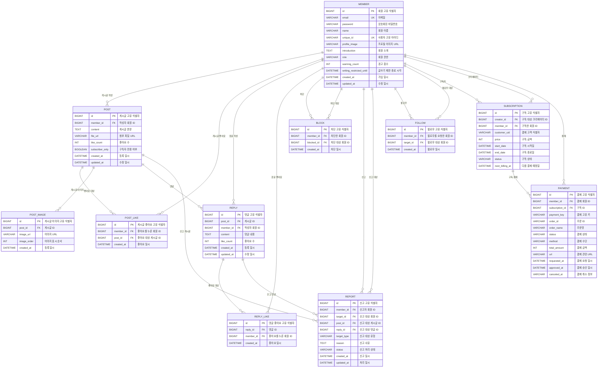

# 1. 데이터베이스 모델링 및 ERD 명세서 (LinkUp SNS)

## 목차

- [1. 데이터베이스 모델링 및 ERD 명세서 (LinkUp SNS)](#1-데이터베이스-모델링-및-erd-명세서-linkup-sns)
- [1.1 엔티티 관계 다이어그램 (ERD)](#11-엔티티-관계-다이어그램-erd)
- [1.2 테이블별 상세 컬럼 명세](#12-테이블별-상세-컬럼-명세)
  - [1.2.1 member (회원)](#121-member-회원)
  - [1.2.2 post (게시글)](#122-post-게시글)
  - [1.2.3 post_image (게시글 이미지)](#123-post_image-게시글-이미지)
  - [1.2.4 post_like (게시글 좋아요)](#124-post_like-게시글-좋아요)
  - [1.2.5 reply (댓글)](#125-reply-댓글)
  - [1.2.6 reply_like (댓글 좋아요)](#126-reply_like-댓글-좋아요)
  - [1.2.7 block (차단)](#127-block-차단)
  - [1.2.8 report (신고)](#128-report-신고)
  - [1.2.9 follow (팔로우)](#129-follow-팔로우)
  - [1.2.10 subscription (구독)](#1210-subscription-구독)
  - [1.2.11 payment (결제)](#1211-payment-결제)

---

## 1.1 엔티티 관계 다이어그램 (ERD)

LinkUp SNS 서비스의 회원, 게시글, 댓글, 좋아요, 팔로우, 차단, 신고 및 구독과 결제 기능을 구성하는 11개 핵심 테이블의 전체 구조도.

# LinkUp ERD

```mermaid
erDiagram

    MEMBER ||--o{ POST : "게시글 작성"
    MEMBER ||--o{ POST_LIKE : "게시글 좋아요"
    POST ||--o{ POST_LIKE : "좋아요 대상"

    POST ||--o{ POST_IMAGE : "게시글 이미지"

    MEMBER ||--o{ REPLY : "댓글 작성"
    POST ||--o{ REPLY : "댓글"

    MEMBER ||--o{ REPLY_LIKE : "댓글 좋아요"
    REPLY ||--o{ REPLY_LIKE : "좋아요 대상"

    MEMBER ||--o{ BLOCK : "차단"
    MEMBER ||--o{ BLOCK : "차단 대상"

    MEMBER ||--o{ REPORT : "신고"
    MEMBER ||--o{ REPORT : "신고 대상"
    POST ||--o{ REPORT : "신고 게시글"
    REPLY ||--o{ REPORT : "신고 댓글"

    MEMBER ||--o{ FOLLOW : "팔로우"
    MEMBER ||--o{ FOLLOW : "팔로우 대상"

    MEMBER ||--o{ SUBSCRIPTION : "구독자"
    MEMBER ||--o{ SUBSCRIPTION : "크리에이터"

    MEMBER ||--o{ PAYMENT : "결제"
    SUBSCRIPTION ||--o{ PAYMENT : "구독 결제"


    MEMBER {
        BIGINT id PK "회원 고유 식별자"
        VARCHAR email UK "이메일"
        VARCHAR password "암호화된 비밀번호"
        VARCHAR name "회원 이름"
        VARCHAR unique_id UK "사용자 고유 아이디"
        VARCHAR profile_image "프로필 이미지 URL"
        TEXT introduction "회원 소개"
        VARCHAR role "회원 권한"
        INT warning_count "경고 횟수"
        DATETIME writing_restricted_until "글쓰기 제한 종료 시각"
        DATETIME created_at "가입 일시"
        DATETIME updated_at "수정 일시"
    }


    POST {
        BIGINT id PK "게시글 고유 식별자"
        BIGINT member_id FK "작성자 회원 ID"
        TEXT content "게시글 본문"
        VARCHAR file_url "첨부 파일 URL"
        INT like_count "좋아요 수"
        BOOLEAN subscriber_only "구독자 전용 여부"
        DATETIME created_at "등록 일시"
        DATETIME updated_at "수정 일시"
    }


    POST_IMAGE {
        BIGINT id PK "게시글 이미지 고유 식별자"
        BIGINT post_id FK "게시글 ID"
        VARCHAR image_url "이미지 URL"
        INT image_order "이미지 표시 순서"
        DATETIME created_at "등록 일시"
    }


    POST_LIKE {
        BIGINT id PK "게시글 좋아요 고유 식별자"
        BIGINT member_id FK "좋아요를 누른 회원 ID"
        BIGINT post_id FK "좋아요 대상 게시글 ID"
        DATETIME created_at "좋아요 일시"
    }


    REPLY {
        BIGINT id PK "댓글 고유 식별자"
        BIGINT post_id FK "게시글 ID"
        BIGINT member_id FK "작성자 회원 ID"
        TEXT content "댓글 내용"
        INT like_count "좋아요 수"
        DATETIME created_at "등록 일시"
        DATETIME updated_at "수정 일시"
    }


    REPLY_LIKE {
        BIGINT id PK "댓글 좋아요 고유 식별자"
        BIGINT reply_id FK "댓글 ID"
        BIGINT member_id FK "좋아요를 누른 회원 ID"
        DATETIME created_at "좋아요 일시"
    }


    BLOCK {
        BIGINT id PK "차단 고유 식별자"
        BIGINT member_id FK "차단한 회원 ID"
        BIGINT blocked_id FK "차단 대상 회원 ID"
        DATETIME created_at "차단 일시"
    }


    REPORT {
        BIGINT id PK "신고 고유 식별자"
        BIGINT member_id FK "신고자 회원 ID"
        BIGINT target_id FK "신고 대상 회원 ID"
        BIGINT post_id FK "신고 대상 게시글 ID"
        BIGINT reply_id FK "신고 대상 댓글 ID"
        VARCHAR target_type "신고 대상 유형"
        TEXT reason "신고 사유"
        VARCHAR status "신고 처리 상태"
        DATETIME created_at "신고 일시"
        DATETIME updated_at "처리 일시"
    }


    FOLLOW {
        BIGINT id PK "팔로우 고유 식별자"
        BIGINT member_id FK "팔로우를 요청한 회원 ID"
        BIGINT target_id FK "팔로우 대상 회원 ID"
        DATETIME created_at "팔로우 일시"
    }


    SUBSCRIPTION {
        BIGINT id PK "구독 고유 식별자"
        BIGINT creator_id FK "구독 대상 크리에이터 ID"
        BIGINT member_id FK "구독한 회원 ID"
        VARCHAR customer_uid "결제 고객 식별자"
        INT price "구독 금액"
        DATETIME start_date "구독 시작일"
        DATETIME end_date "구독 종료일"
        VARCHAR status "구독 상태"
        DATETIME next_billing_at "다음 결제 예정일"
    }


    PAYMENT {
        BIGINT id PK "결제 고유 식별자"
        BIGINT member_id FK "결제 회원 ID"
        BIGINT subscription_id FK "구독 ID"
        VARCHAR payment_key "결제 고유 키"
        VARCHAR order_id "주문 ID"
        VARCHAR order_name "주문명"
        VARCHAR status "결제 상태"
        VARCHAR method "결제 수단"
        INT total_amount "결제 금액"
        VARCHAR url "결제 관련 URL"
        DATETIME requested_at "결제 요청 일시"
        DATETIME approved_at "결제 승인 일시"
        VARCHAR canceled_at "결제 취소 정보"
    }
```
---

## 1.2 테이블별 상세 컬럼 명세

### 1.2.1 member (회원)
| 컬럼명 | 데이터 타입 | 제약 조건 | 설명 |
| --- | --- | --- | --- |
| id | BIGINT | PK, NOT NULL, AUTO_INCREMENT | 회원 고유 식별자 |
| email | VARCHAR(100) | UNIQUE, NOT NULL | 회원 이메일 |
| password | VARCHAR(255) | NULL | 암호화된 비밀번호 |
| name | VARCHAR(50) | NOT NULL | 회원 이름 |
| unique_id | VARCHAR(30) | UNIQUE, NOT NULL | 사용자 고유 아이디 |
| profile_image | VARCHAR(255) | NULL | 프로필 이미지 URL |
| introduction | TEXT | NULL | 회원 소개 |
| role | VARCHAR(20) | NOT NULL, DEFAULT 'ROLE_USER' | 회원 권한 |
| warning_count | INT | NOT NULL, DEFAULT 0 | 경고 횟수 |
| writing_restricted_until | DATETIME | NULL | 글쓰기 제한 종료 시각 |
| created_at | DATETIME | DEFAULT CURRENT_TIMESTAMP | 회원 가입 일시 |
| updated_at | DATETIME | DEFAULT CURRENT_TIMESTAMP, ON UPDATE CURRENT_TIMESTAMP | 회원 정보 수정 일시 |

### 1.2.2 post (게시글)
| 컬럼명             | 데이터 타입       | 제약 조건                                                 | 설명            |
| --------------- | ------------ | ----------------------------------------------------- | ------------- |
| id              | BIGINT       | PK, NOT NULL, AUTO_INCREMENT                          | 게시글 고유 식별자    |
| member_id       | BIGINT       | FK (`member.id`), NOT NULL                            | 게시글 작성자 회원 ID |
| content         | TEXT         | NOT NULL                                              | 게시글 본문        |
| file_url        | VARCHAR(255) | NULL                                                  | 첨부 파일 URL     |
| like_count      | INT          | NOT NULL, DEFAULT 0                                   | 게시글 좋아요 수     |
| subscriber_only | BOOLEAN      | NOT NULL, DEFAULT FALSE                               | 구독자 전용 여부     |
| created_at      | DATETIME     | DEFAULT CURRENT_TIMESTAMP                             | 게시글 등록 일시     |
| updated_at      | DATETIME     | DEFAULT CURRENT_TIMESTAMP ON UPDATE CURRENT_TIMESTAMP | 게시글 수정 일시     |

### 1.2.3 post_image (게시글 이미지)
| 컬럼명         | 데이터 타입       | 제약 조건                        | 설명          |
| ----------- | ------------ | ---------------------------- | ----------- |
| id          | BIGINT       | PK, NOT NULL, AUTO_INCREMENT | 이미지 고유 식별자  |
| post_id     | BIGINT       | FK (`post.id`), NOT NULL     | 게시글 ID      |
| image_url   | VARCHAR(255) | NOT NULL                     | 게시글 이미지 URL |
| image_order | INT          | NOT NULL                     | 이미지 표시 순서   |
| created_at  | DATETIME     | DEFAULT CURRENT_TIMESTAMP    | 이미지 등록 일시   |

### 1.2.4 post_like (게시글 좋아요)
| 컬럼명        | 데이터 타입   | 제약 조건                        | 설명            |
| ---------- | -------- | ---------------------------- | ------------- |
| id         | BIGINT   | PK, NOT NULL, AUTO_INCREMENT | 좋아요 고유 식별자    |
| member_id  | BIGINT   | FK (`member.id`), NOT NULL   | 좋아요를 누른 회원 ID |
| post_id    | BIGINT   | FK (`post.id`), NOT NULL     | 좋아요 대상 게시글 ID |
| created_at | DATETIME | DEFAULT CURRENT_TIMESTAMP    | 좋아요 등록 일시     |
- 고유 제약조건: UNIQUE (member_id, post_id)
- 동일 회원이 동일 게시글에 중복으로 좋아요를 등록하지 못하도록 제한한다.

### 1.2.5 reply (게시글 댓글)
| 컬럼명        | 데이터 타입   | 제약 조건                                                 | 설명             |
| ---------- | -------- | ----------------------------------------------------- | -------------- |
| id         | BIGINT   | PK, NOT NULL, AUTO_INCREMENT                          | 댓글 고유 식별자      |
| post_id    | BIGINT   | FK (`post.id`), NOT NULL                              | 댓글이 작성된 게시글 ID |
| member_id  | BIGINT   | FK (`member.id`), NOT NULL                            | 댓글 작성자 회원 ID   |
| content    | TEXT     | NOT NULL                                              | 댓글 내용          |
| like_count | INT      | NOT NULL, DEFAULT 0                                   | 댓글 좋아요 수       |
| created_at | DATETIME | DEFAULT CURRENT_TIMESTAMP                             | 댓글 등록 일시       |
| updated_at | DATETIME | DEFAULT CURRENT_TIMESTAMP ON UPDATE CURRENT_TIMESTAMP | 댓글 수정 일시       |

### 1.2.6 reply_like (댓글 좋아요)
| 컬럼명        | 데이터 타입   | 제약 조건                        | 설명            |
| ---------- | -------- | ---------------------------- | ------------- |
| id         | BIGINT   | PK, NOT NULL, AUTO_INCREMENT | 댓글 좋아요 고유 식별자 |
| reply_id   | BIGINT   | FK (`reply.id`), NOT NULL    | 좋아요 대상 댓글 ID  |
| member_id  | BIGINT   | FK (`member.id`), NOT NULL   | 좋아요를 누른 회원 ID |
| created_at | DATETIME | DEFAULT CURRENT_TIMESTAMP    | 좋아요 등록 일시     |
- 고유 제약조건: UNIQUE (member_id, reply_id)
- 동일 회원이 동일 댓글에 중복으로 좋아요를 등록하지 못하도록 제한한다.

### 1.2.7 block (회원 차단)
| 컬럼명        | 데이터 타입   | 제약 조건                        | 설명            |
| ---------- | -------- | ---------------------------- | ------------- |
| id         | BIGINT   | PK, NOT NULL, AUTO_INCREMENT | 차단 고유 식별자     |
| member_id  | BIGINT   | FK (`member.id`), NOT NULL   | 차단을 수행한 회원 ID |
| blocked_id | BIGINT   | FK (`member.id`), NOT NULL   | 차단 대상 회원 ID   |
| created_at | DATETIME | DEFAULT CURRENT_TIMESTAMP    | 차단 등록 일시      |
- 고유 제약조건: UNIQUE (member_id, blocked_id)
- 동일 회원을 중복으로 차단하지 못하도록 제한한다.

### 1.2.8 report (신고)
| 컬럼명         | 데이터 타입      | 제약 조건                        | 설명           |
| ----------- | ----------- | ---------------------------- | ------------ |
| id          | BIGINT      | PK, NOT NULL, AUTO_INCREMENT | 신고 고유 식별자    |
| member_id   | BIGINT      | FK (`member.id`), NOT NULL   | 신고자 회원 ID    |
| target_id   | BIGINT      | FK (`member.id`), NOT NULL   | 신고 대상 회원 ID  |
| post_id     | BIGINT      | FK (`post.id`), NULL         | 신고 대상 게시글 ID |
| reply_id    | BIGINT      | FK (`reply.id`), NULL        | 신고 대상 댓글 ID  |
| target_type | VARCHAR(20) | NOT NULL                     | 신고 대상 유형     |
| reason      | TEXT        | NOT NULL                     | 신고 사유        |
| status      | VARCHAR(20) | NOT NULL, DEFAULT 'WAIT'     | 신고 처리 상태     |
| created_at  | DATETIME    | DEFAULT CURRENT_TIMESTAMP    | 신고 등록 일시     |
| updated_at  | DATETIME    | NULL                         | 신고 처리 일시     |

### 1.2.9 follow (회원 팔로우)
| 컬럼명        | 데이터 타입   | 제약 조건                        | 설명             |
| ---------- | -------- | ---------------------------- | -------------- |
| id         | BIGINT   | PK, NOT NULL, AUTO_INCREMENT | 팔로우 고유 식별자     |
| member_id  | BIGINT   | FK (`member.id`), NOT NULL   | 팔로우를 수행한 회원 ID |
| target_id  | BIGINT   | FK (`member.id`), NOT NULL   | 팔로우 대상 회원 ID   |
| created_at | DATETIME | DEFAULT CURRENT_TIMESTAMP    | 팔로우 등록 일시      |
- 고유 제약조건: UNIQUE (member_id, target_id)
- 동일 회원에 대한 중복 팔로우를 방지한다.

### 1.2.10 subscription (사용자 정기 구독)
| 컬럼명             | 데이터 타입       | 제약 조건                               | 설명                |
| --------------- | ------------ | ----------------------------------- | ----------------- |
| id              | BIGINT       | PK, NOT NULL, AUTO_INCREMENT        | 구독 고유 식별자         |
| creator_id      | BIGINT       | FK (`member.id`), NOT NULL          | 구독 대상 크리에이터 회원 ID |
| member_id       | BIGINT       | FK (`member.id`), NOT NULL          | 구독을 신청한 회원 ID     |
| customer_uid    | VARCHAR(100) | NULL                                | 결제 고객 식별자         |
| price           | INT          | NOT NULL                            | 구독 금액             |
| start_date      | DATETIME     | NOT NULL, DEFAULT CURRENT_TIMESTAMP | 구독 시작 일시          |
| end_date        | DATETIME     | NULL                                | 구독 종료 일시          |
| status          | VARCHAR(20)  | NOT NULL                            | 구독 상태             |
| next_billing_at | DATETIME     | NULL, DEFAULT (CURRENT_TIMESTAMP + INTERVAL 30 DAY)               | 다음 자동 결제 예정 일시    |
- creator_id와 member_id에는 UNIQUE 제약조건을 적용하지 않는다.
- 구독 해지 후 재구독 시 새로운 구독 이력을 생성할 수 있도록 설계한다.

### 1.2.11 payment (결제)
| 컬럼명             | 데이터 타입       | 제약 조건                            | 설명            |
| --------------- | ------------ | -------------------------------- | ------------- |
| id              | BIGINT       | PK, NOT NULL, AUTO_INCREMENT     | 결제 고유 식별자     |
| member_id       | BIGINT       | FK (`member.id`), NOT NULL       | 결제를 진행한 회원 ID |
| subscription_id | BIGINT       | FK (`subscription.id`), NOT NULL | 연결된 구독 ID     |
| payment_key     | VARCHAR(255) | NOT NULL                         | 결제 고유 키       |
| order_id        | VARCHAR(100) | NOT NULL                         | 주문 ID         |
| order_name      | VARCHAR(100) | NOT NULL                         | 주문명           |
| status          | VARCHAR(50)  | NOT NULL                         | 결제 상태         |
| method          | VARCHAR(20)  | NOT NULL                         | 결제 수단         |
| total_amount    | INT          | NOT NULL                         | 결제 금액         |
| url             | VARCHAR(300) | NOT NULL                         | 결제 관련 URL     |
| requested_at    | DATETIME     | NOT NULL                         | 결제 요청 일시      |
| approved_at     | DATETIME     | NOT NULL                         | 결제 승인 일시      |
| canceled_at     | VARCHAR(100) | NULL                             | 결제 취소 정보      |
